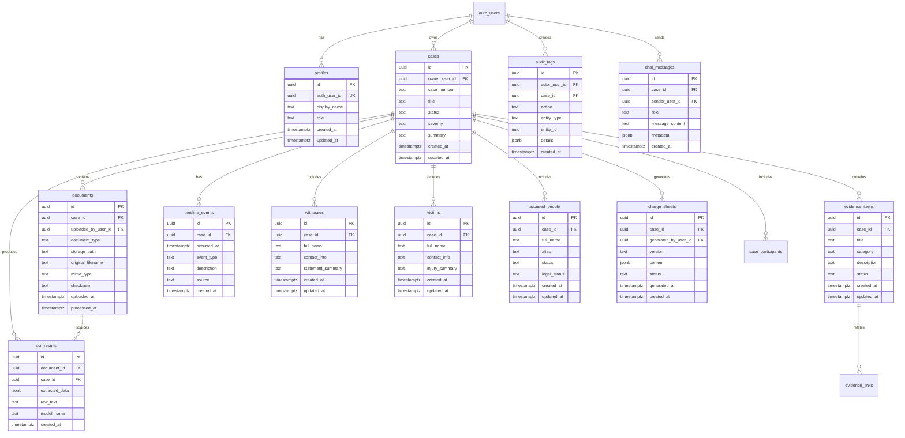

# Entity Relationship Diagram

```mermaid
erDiagram
    auth_users ||--o{ profiles : has
    auth_users ||--o{ cases : owns
    auth_users ||--o{ audit_logs : creates
    auth_users ||--o{ chat_messages : sends

    cases ||--o{ documents : contains
    cases ||--o{ ocr_results : produces
    cases ||--o{ evidence_items : contains
    cases ||--o{ timeline_events : has
    cases ||--o{ witnesses : includes
    cases ||--o{ victims : includes
    cases ||--o{ accused_people : includes
    cases ||--o{ charge_sheets : generates

    documents ||--o{ ocr_results : sources
    evidence_items ||--o{ evidence_links : relates
    cases ||--o{ case_participants : includes

    profiles {
        uuid id PK
        uuid auth_user_id UK
        text display_name
        text role
        timestamptz created_at
        timestamptz updated_at
    }

    cases {
        uuid id PK
        uuid owner_user_id FK
        text case_number
        text title
        text status
        text severity
        text summary
        timestamptz created_at
        timestamptz updated_at
    }

    documents {
        uuid id PK
        uuid case_id FK
        uuid uploaded_by_user_id FK
        text document_type
        text storage_path
        text original_filename
        text mime_type
        text checksum
        timestamptz uploaded_at
        timestamptz processed_at
    }

    ocr_results {
        uuid id PK
        uuid document_id FK
        uuid case_id FK
        jsonb extracted_data
        text raw_text
        text model_name
        timestamptz created_at
    }

    evidence_items {
        uuid id PK
        uuid case_id FK
        text title
        text category
        text description
        text status
        timestamptz created_at
        timestamptz updated_at
    }

    timeline_events {
        uuid id PK
        uuid case_id FK
        timestamptz occurred_at
        text event_type
        text description
        text source
        timestamptz created_at
    }

    witnesses {
        uuid id PK
        uuid case_id FK
        text full_name
        text contact_info
        text statement_summary
        timestamptz created_at
        timestamptz updated_at
    }

    victims {
        uuid id PK
        uuid case_id FK
        text full_name
        text contact_info
        text injury_summary
        timestamptz created_at
        timestamptz updated_at
    }

    accused_people {
        uuid id PK
        uuid case_id FK
        text full_name
        text alias
        text status
        text legal_status
        timestamptz created_at
        timestamptz updated_at
    }

    charge_sheets {
        uuid id PK
        uuid case_id FK
        uuid generated_by_user_id FK
        text version
        jsonb content
        text status
        timestamptz generated_at
        timestamptz created_at
    }

    chat_messages {
        uuid id PK
        uuid case_id FK
        uuid sender_user_id FK
        text role
        text message_content
        jsonb metadata
        timestamptz created_at
    }

    audit_logs {
        uuid id PK
        uuid actor_user_id FK
        uuid case_id FK
        text action
        text entity_type
        uuid entity_id
        jsonb details
        timestamptz created_at
    }
```
